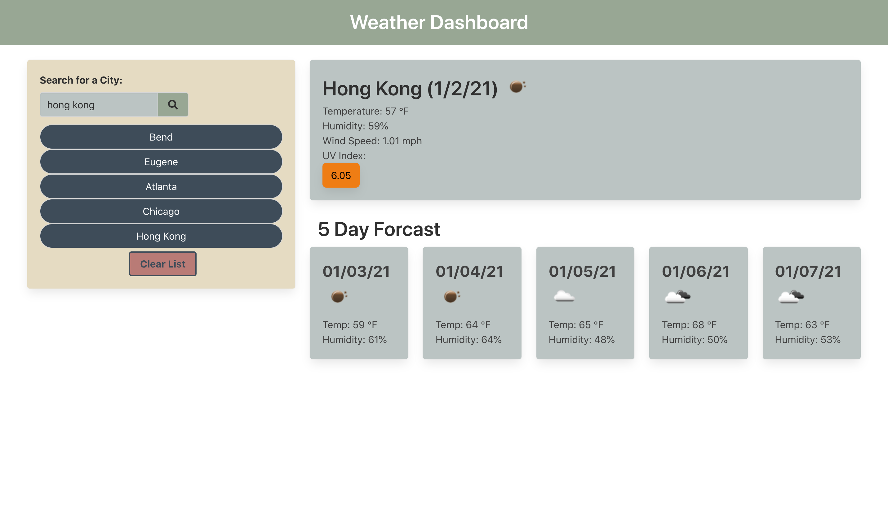
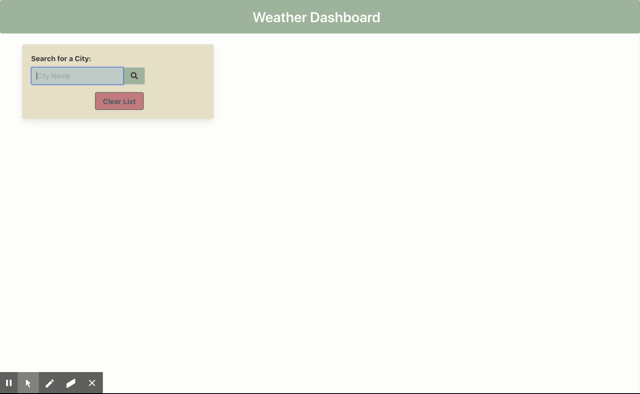

# Weather-Dashboard
An application that allows a user to search a city and receive information about the current weather as well as a five day forecast for that particular city. This page uses AJAX calls from the Open Weather Map API. Any time a user searches a city, the city is saved to local storage and a button with the name of the city search will be posted to the page. If a user clicks on a button, the page will load weather information for that city. A base city will always be present, even if the list is cleared. If an invalid input is searched, the app will alert a retry message via a modal.

## Link to webpage
https://haywah27.github.io/Weather-Dashboard/

## User Story
> AS A traveler
> I WANT to see the weather outlook for multiple cities
> SO THAT I can plan a trip accordingly

## Deployed Website 

## Demo

## Summary of Changes
* Adding navbar and initial search box
* Creating onClick event on search box button
* Creating first AJAX call for searched city
* Returning content for current weather
* Creating another AJAX call for UV index
* Adding content for forcast function
* Posting date
* Returning icon from AJAX call
* Creating UV function
* Adding cards for five day forcast
* Displaying content returns on forcast cards
* Setting up initial local storage
* Adding city button functionality
* Adding function to post active buttons from local storage
* Checking local storage to avoid duplicates
* Posting last search on page refresh
* Avoiding posting an invalid city to local storage or a button 
* Having a constant city posted even if local storage is empty
* Capitalizing multiple word city name
* Removing constant city

